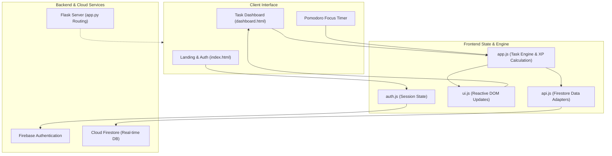

# StudyForge

[](https://github.com/ItzSaurav/studyforge/actions/workflows/ci.yml)

A gamified task and study tracker web application built to make daily study sessions more engaging through XP progression, levels, and streak counters.

Live Demo: [studyforge-pearl.vercel.app](https://studyforge-pearl.vercel.app/)

---

## Architecture and Data Flow



---

## Why I Built This

Standard to-do lists get abandoned quickly during college exam preparation. I built StudyForge to turn regular study tasks into a level-up system similar to an RPG. When you finish a task or complete a focus session, you gain experience points and level up, which helps maintain consistency.

---

## Core Features

- **XP and Leveling System**: Completing tasks awards experience points based on estimated effort. Reaching the XP threshold advances your account level.
- **Daily Streak Counter**: Tracks consecutive days of activity to encourage daily habit building.
- **Pomodoro Focus Timer**: Integrated 25-minute focus session timer linked to specific study tasks.
- **Cloud Synchronization**: User authentication and task data are synced in real time using Firebase Authentication and Cloud Firestore.
- **Task Organization**: Filter and search tasks by status, subject, and priority.

---

## Tech Stack

- **Frontend**: HTML5, CSS3, Vanilla JavaScript (ES6+)
- **Backend / Routing**: Python (Flask) for local serving and routing
- **Authentication & Database**: Firebase Authentication, Google Cloud Firestore
- **Deployment**: Vercel serverless configuration

---

## Project Structure

```text
studyforge/
├── studyforge/
│   ├── app.py                # Flask entry point and static route handlers
│   ├── config.py             # Server port and environment configuration
│   ├── requirements.txt      # Python dependencies (Flask)
│   ├── vercel.json           # Vercel deployment routes
│   └── static/
│       ├── index.html        # Landing and login page
│       ├── dashboard.html    # Main user dashboard and task board
│       ├── css/              # Modular stylesheets (auth, base, dashboard)
│       └── js/               # Frontend logic (auth, tasks, focus timer)
└── README.md                 # Project documentation
```

---

## Running Locally

### 1. Clone the Repository
```bash
git clone https://github.com/ItzSaurav/studyforge.git
cd studyforge
```

### 2. Install Dependencies
```bash
pip install -r studyforge/requirements.txt
```

### 3. Configure Firebase
Add your Firebase configuration credentials to `studyforge/static/js/firebase.js` if running your own database instance.

### 4. Start the Application
```bash
python studyforge/app.py
```
Open your browser and navigate to `http://localhost:5000`.

---

## License

MIT License. Free for educational and personal use.
